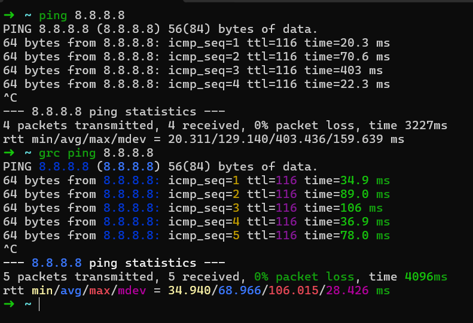

# Generic Colouriser (GRC)

It's a syntax highlighter for system logs and certain commands outputs. It's provide two tools for interaction:

- `grcat`: It takes an output, colorize it and write to the _stdoutput_ again.
- `grc`: It acts as a frontend, it receives a command and pipe its stdoutput into `grcat`.



## Getting Started

1. Install the library with:

```shell
sudo apt-get install grc
# or
brew install grc
```

2. Create these symlinks:

```shell
ln -s dotfiles/grc/logs.conf ~/.grc/logs.conf
ln -s dotfiles/grc/.grc.zsh /etc/.grc.zsh
```

## Examples

```shell
grc ping 8.8.8.8
```

### Pipe logs output with GRC

Send the _stdout_ from a command to `grc` colorize log messages keywords:

```shell
alias clogs='grc -c ~/.grc/logs.conf $1$ 2>&1'

## Using
clogs python3.12 -c 'print("INFO Hello from inline python\nERROR there is an error with your command")'
```

## References

- [GRC Official Repository](https://github.com/garabik/grc)
