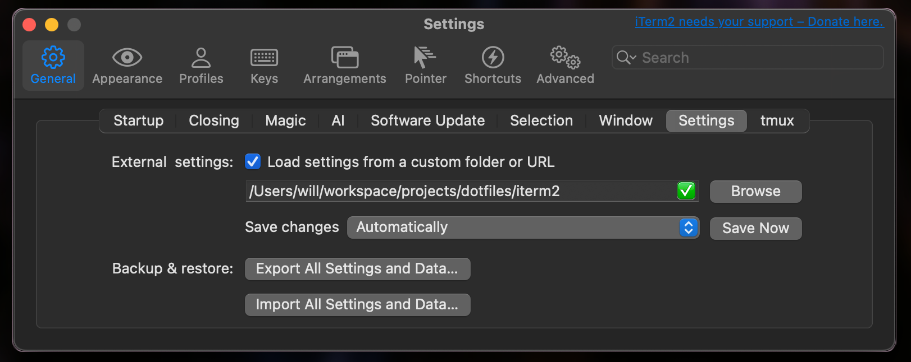

## iTerm2 Config

Terminal emulator for MacOS.

## Update settings

Go to `Preferences ▹ General ▹ Preferences` and choose a specific folder to load/save all your settings.

## References

- [iTerm2 Official Site](https://iterm2.com/)
- [Iterm2 - Color Schemes](https://iterm2colorschemes.com/)
