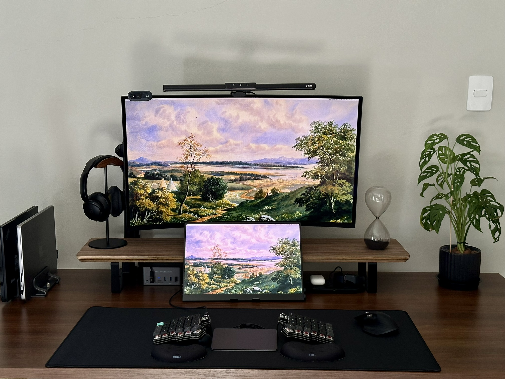

## My keyboard config

This is my QMK/VIAL key-maps for the [Silakka54]() split keyboard.
Currently I'm trying to get used to the Corne layout (6x3) as I'm planning to switch to a wireless
version build with [ZMK]().

- [**Config file for the default Silakka54 layout**](./silakka_54.vil)
- [**Config file for the corne version**](./silakka_corne_layout.vil)
